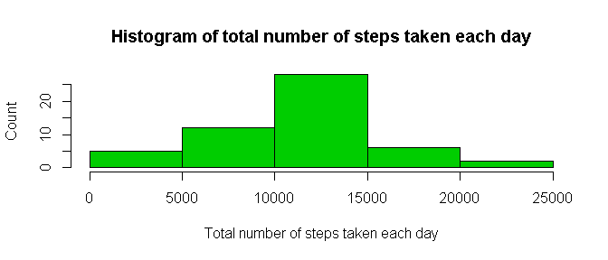
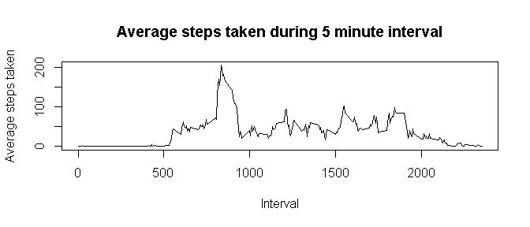
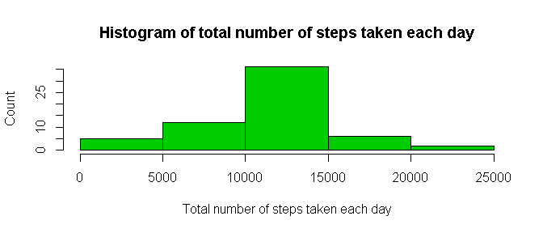
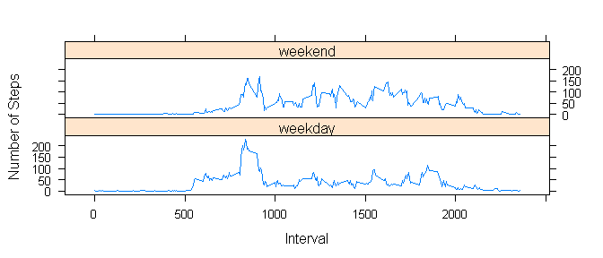

# Reproducible Research: Peer Assessment 1

```r
# Load knitr for documentation
library(knitr)
# Load dplyr in order to summarise the data.
library(dplyr)
```

```
## 
## Attaching package: 'dplyr'
```

```
## The following objects are masked from 'package:stats':
## 
##     filter, lag
```

```
## The following objects are masked from 'package:base':
## 
##     intersect, setdiff, setequal, union
```

```r
# Load lattice for panel plot
library("lattice")
```


## Loading and preprocessing the data

```r
if(!file.exists("activity_monitoring_data.zip")) 
{
        temp <- tempfile()
        download.file("https://d396qusza40orc.cloudfront.net/repdata%2Fdata%2Factivity.zip",temp)
        file <- unzip(temp)
        unlink(temp)
}
rawdata <- read.csv(file)
unlink(file)
# Convert date variable from factor to date, and remove NAs
data <- na.omit(rawdata)
data$date <- as.Date(data$date)
# Group data by date, and summarize the sum of steps  
stepsperday <- data %>% 
        group_by(date) %>% 
        summarize(TotalSteps=sum(steps))
```
## Histogram of the total number of steps taken each day

```r
hist(stepsperday$TotalSteps, 
     xlab="Total number of steps taken each day", 
     ylab="Count", 
     main="Histogram of total number of steps taken each day",
     col=3)
```


  
## What is mean and median total number of steps taken per day?

```r
meansteps <- mean(stepsperday$TotalSteps)
cat("Mean of number of steps taken each day",meansteps,"\n")
```

```
## Mean of number of steps taken each day 10766.19
```

```r
mediansteps <- median(stepsperday$TotalSteps)
cat("Median of number of steps taken each day",mediansteps,"\n")
```

```
## Median of number of steps taken each day 10765
```

## Time series plot of the average number of steps taken

```r
# Group data by 5 minute interval and summarize the average
# number of steps in that interval
fiveaverage <- data %>% group_by(interval) %>% summarize(AverageSteps=mean(steps))
# Make an average activity plot
plot(fiveaverage$interval, fiveaverage$AverageSteps, 
     type="l",
     xlab="Interval",
     ylab="Average steps taken",
     main="Average steps taken during 5 minute interval")
```


  
## The 5-minute interval that, on average, contains the maximum number of steps

```r
maxstepinterval <- fiveaverage$interval[which.max(fiveaverage$AverageSteps)]
cat("The highest average step count happened during interval",maxstepinterval,"\n")
```

```
## The highest average step count happened during interval 835
```
## Code to describe and show a strategy for imputing missing data

```r
# Calculate number of missing values
missing <- sum(is.na(rawdata$steps))
# Create a filled in dataset by assigning the average value 
# for that time interval if an NA is found.
filldata <- rawdata
# Group data by 5 minute interval and summarize the average
# number of steps in that interval
fiveaverage <- rawdata %>%
        group_by(interval) %>%
        summarize(AverageSteps=mean(steps,na.rm=T))
for (i in 1:nrow(filldata)) 
{
        if (is.na(filldata$steps[i])) 
        {
                # Find the index value for when the interval matches the average
                ndx <- which(filldata$interval[i] == fiveaverage$interval)
                # Assign the value to replace the NA
                filldata$steps[i] <- fiveaverage[ndx,]$AverageSteps
        }
}
# Make sure the date variable is still a date.
filldata$date <- as.Date(filldata$date)
# Group data by date, and summarize the sum of steps
fillstepsperday <- filldata %>% 
        group_by(date) %>% 
        summarize(TotalSteps=sum(steps))
```
## Histogram of the total number of steps taken each day after missing values are imputed

```r
# Show histogram of steps per day
hist(fillstepsperday$TotalSteps, 
     xlab="Total number of steps taken each day", 
     ylab="Count", 
     main="Histogram of total number of steps taken each day",
     col=3)
```



## Are there differences in activity patterns between weekdays and weekends?

```r
fillmeansteps <- mean(fillstepsperday$TotalSteps)
cat("Mean of number of steps taken each day",fillmeansteps,"\n")
```

```
## Mean of number of steps taken each day 10766.19
```

```r
fillmediansteps <- median(fillstepsperday$TotalSteps)
cat("Median of number of steps taken each day",fillmediansteps,"\n")
```

```
## Median of number of steps taken each day 10766.19
```

```r
# Make weekday variable
filldata$day <- weekdays(filldata$date)
# Define all days as weekdays
filldata$daytype <- "weekday"
# Fix days that are saturday or sunday to be weekends
filldata$daytype[filldata$day %in% c("Saturday", "Sunday")] <- "weekend"
# Group data by 5 minute interval and summarize the average
# number of steps in that interval
dayaverage <- filldata %>% group_by(daytype, interval) %>% summarize(AverageSteps=mean(steps))
xyplot(AverageSteps~interval|factor(daytype),data = dayaverage,
       type='l',layout=c(1,2),xlab='Interval',ylab='Number of Steps')
```


